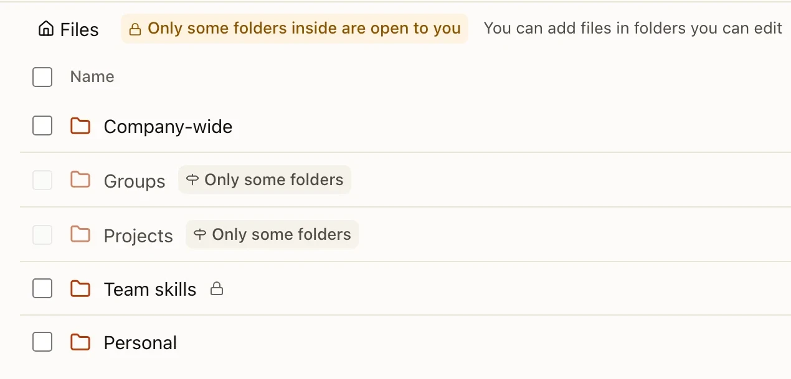
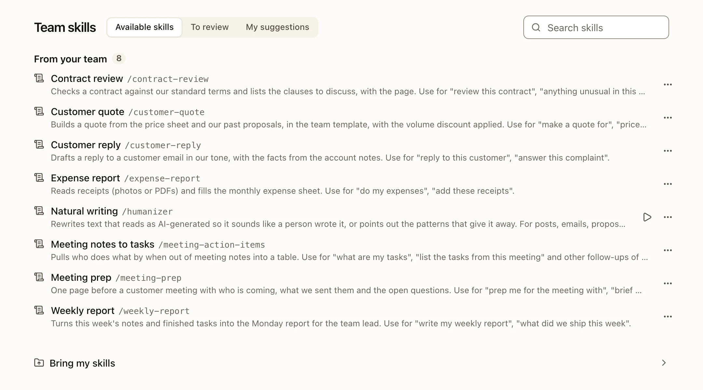

<div align="center">

<picture><source media="(prefers-color-scheme: dark)" srcset="editions/trina/branding/logo/mark-dark.svg"></picture>

<h1>Trina AX</h1>

<b>全队共用的 AI。</b><br>
Trina AX 把团队的文件、技能和工具放在一台服务器上。每个人的 AI 都从这里开始，<br>AI 打开的每个文件，都会按提问者本人的权限检查。

<a href="https://ax.trina.app/download"></a>&nbsp;&nbsp;<a href="https://ax.trina.app/download"></a>&nbsp;&nbsp;<a href="https://apps.apple.com/app/trina-ax/id6829192435"></a>&nbsp;&nbsp;<a href="https://play.google.com/store/apps/details?id=app.trina.ax"></a><br>
<sub>Linux：.deb 和 AppImage（x64、arm64）见<a href="https://ax.trina.app/download">下载页面</a></sub>

[官网](https://ax.trina.app) · [文档](docs/README.md) · [套餐](https://ax.trina.app/pricing) · [Discord](https://discord.gg/zUVfSR8MVk)

[English](README.md) · [한국어](README.ko.md) · [日本語](README.ja.md) · [Español](README.es.md) · 简体中文

</div>

https://github.com/user-attachments/assets/2d0b9459-eae5-4e14-9486-ea81b0fd056c

<p align="center"><sub>新员工的 AI 第一天能做什么。80 秒的故事。</sub><br>开源（AGPL-3.0）· 自托管免费，不限人数<br><br><a href="https://github.com/trina-app/trina-ax?tab=readme-ov-file"></a><br><sub>然后点页面顶部的 ☆ Star。点个 Star 能让更多团队发现 Trina AX。</sub></p>

<br>

<picture><source media="(prefers-color-scheme: dark)" srcset="docs/images/readme/v4/divider-dark.png"></picture>

## 只需设置一次，全队都能用

**一个 AI 账户，全队共用。** 接入一个 Claude 或 OpenAI 的 API 密钥（或条款允许的套餐），全队都用它提问，可按人、群组或团队设置 token 上限。

一个人在团队服务器上设置好，每个人的 AI 从第一个问题起就能用上，无论在浏览器还是应用里。其他人不用装 Claude Code，也不用复制技能；最多只是登录自己的账户。

<picture><source media="(prefers-color-scheme: dark)" srcset="docs/images/readme/v4/set-up-once-zh-dark.webp"></picture>

| 只需设置一次 | 每个人得到什么 |
| --- | --- |
| **AI 账户。** 所有者或管理员接入 Claude 或 OpenAI 的 API 密钥，或条款允许的套餐。 | 全队都能得到回答，可按人、群组或团队设置 token 上限。 |
| **Google。** 把云端硬盘文件夹共享给团队，或为 Gmail、Calendar、Docs 和 Sheets 接入一个团队账户（共享邮箱或日历）。 | 你选的人可以在自己的聊天里使用。每个人也可以另外接入自己的 Google 账户。 |
| **应用。** 应用列表里的 Higgsfield、Notion、Linear、Figma 等，或通过地址接入的任意 MCP 服务器，比如 Bright Data。 | 每个人的聊天里都能用这个应用的工具：用一个团队登录，或每个人用自己的账户登录。 |
| **公司 API。** 一个地址、一个密钥和几行说明。 | AI 调用你们自己的系统，只限那个地址之下。 |
| **Slack。** 所有者或管理员添加一次。 | 在私信或邀请了 Trina 的频道里问 Trina，按你自己的权限。 |
| **技能。** 写一个 `SKILL.md`，或直接带来你 `.claude`、`.codex` 文件夹里的技能。 | 每个人的 AI 都按同样的步骤做。输入 `/` 就能用。 |
| **团队文件。** 一个云盘：全公司、群组、项目、团队技能和个人文件夹。 | 每个人的 AI 都从团队文件开始，只打开这个人能打开的内容。 |

<table>
<tr>
<td colspan="2"><br><sub>管理 › 已连接的应用：设置一次，全队都能用</sub></td>
</tr>
<tr>
<td width="50%"><br><sub>一个团队云盘</sub></td>
<td width="50%"><br><sub>团队技能，也能带来你自己的</sub></td>
</tr>
</table>

<br>

<picture><source media="(prefers-color-scheme: dark)" srcset="docs/images/readme/v4/divider-dark.png"></picture>

## 每个人用它做什么

**在任何对话旁边提问，一键发出。** 侧边聊天只有你能看到；点一下，Trina 的回答就发到对话里。


**每个人的 AI 只看到这个人能打开的内容。** Mina 打不开 Finance，她的 AI 也打不开。[权限如何运作](docs/PERMISSIONS.md)


**在团队项目里接着同事的会话做。** 团队项目里的会话会共享给项目成员：打开同事的会话继续做，按你自己的权限处理。其他会话也可以像 Google 云端硬盘文件一样共享给个人或群组。


**按内容找文件。** 每天夜里，团队的 AI 会读取共享、群组和项目文件夹里新增和修改的文件，为每个文件记下一行说明它是什么。所以名叫 `temp.pdf` 的扫描件、名叫 `IMG_2031.jpg` 的照片，也能按内容找到。它使用团队的 AI 账户，从不读取个人文件夹。在 2,238 个虚构文件的测试中，Claude Code 回答 184 个问题时，有这些说明能找对 181 个，没有时找对 172 个。

<table>
<tr>
<td width="50%"><b>定时任务。</b> 交代一次，Trina 就按你定的时间重复，时间按团队时区。<br><br></td>
<td width="50%"><b>访客。</b> 邀请公司外的人进群聊或项目，并决定他们能否使用 AI。<br><br></td>
</tr>
<tr>
<td width="50%"><b>用量与上限。</b> 按人显示回答数、token 和预估费用；可按人、群组或团队设置 token 上限。<br><br></td>
<td width="50%"><b>全局搜索。</b> 用 ⌘K 搜索聊天、历史、项目、文件、技能和定时任务。<br><br></td>
</tr>
<tr>
<td colspan="2"><b>像 Slack 一样的团队聊天，还有 Trina AI。</b> 全员和群组频道、私有频道、私信、群聊、话题和 @提及，网页、桌面和手机都能用，在任何对话旁边都能打开只有你能看到的聊天来问 Trina。<br><br></td>
</tr>
</table>

- **每次改动都会保留。** 不管是人改的还是 AI 改的，任何版本都能恢复。
- **应用内浏览器。** 在桌面应用里，Trina 会在聊天旁边的面板中打开网站、阅读、点击并填写表单，你可以看着它操作，点 Stop 就会停止。除非你允许所有网站，否则打开新网站前会先询问。
- **应用动态发到对话里。** Sentry、GitHub、Stripe、Jira 和 HubSpot 的动态以卡片形式送达。
- **会议记录。** Mac 应用（macOS 14.4 及以上）为 Zoom、Meet 和 Teams 通话做记录。
- **查找工作文件。** 桌面应用在你的电脑上找出最近的工作文件，只添加你选中的。
- **文档。** 读取韩文（HWP/HWPX）正文，预览 PDF 和 PowerPoint。
- **任何设备。** Mac、Windows、Linux、iPhone、Android 和任何浏览器，支持六种语言。

<br>

<picture><source media="(prefers-color-scheme: dark)" srcset="docs/images/readme/v4/divider-dark.png"></picture>

## 开始使用

- **Trina 托管：** 不用自己运维服务器。14 天免费试用，之后按月订阅。[套餐](https://ax.trina.app/pricing)
- **应用：** [Mac、Windows、Linux、iPhone、Android](https://ax.trina.app/download)，或任何浏览器。
- **自托管：** 你们自己的 Linux 服务器、Docker 或办公室 Mac。免费。[Linux](docs/INSTALL-LINUX.en.md) · [Docker](docs/INSTALL-DOCKER.md) · [办公室 Mac](docs/OFFICE.en.md) · [用 AI 助手安装](docs/INSTALL-LINUX.en.md#install-with-your-ai-agent)

<b>用 Docker 自托管</b>（Linux，或装了 OrbStack 的 Mac）

```sh
git clone https://github.com/trina-app/trina-ax.git && cd trina-ax/docker
cp env.example .env && docker compose up -d --build
docker compose exec trina-ax trina-ax-setup-link   # 打开链接，创建所有者账户
```

这种方式比 Linux 安装新，测试也较少；Ubuntu 24.04 服务器需要先做一项主机设置。[Docker 指南](docs/INSTALL-DOCKER.md)

<b>10 分钟在你的电脑上试用</b>（虚构团队，AI 关闭）

```sh
git clone https://github.com/trina-app/trina-ax.git && cd trina-ax
bun install --frozen-lockfile && bun run demo   # → http://127.0.0.1:19760 · alice / teamax-demo-1
```

需要 Bun 1.3.12 和 Go 1.27+。这不是生产环境的安装方式。[详细步骤](docs/QUICKSTART.md)

<br>

<picture><source media="(prefers-color-scheme: dark)" srcset="docs/images/readme/v4/divider-dark.png"></picture>

## 工作原理

一台服务器以 Claude Code 和 Codex 为引擎。无论是人还是他的 AI，每个文件请求都要经过服务器上的同一道权限检查。在 Linux 服务器上，引擎用专用账户在 bubblewrap、Landlock 和 seccomp 沙箱里运行，它的 shell 和内置文件工具都已关闭，只能通过 Trina 的工具打开文件。[安全与权限](docs/security-and-permissions.md)

Trina 提供的是工作空间，不是 AI 本身：请接入你们获得授权的 Claude 或 OpenAI 账号与套餐。AI 用量费由你接入的账号计费。

<details>
<summary><b>数据、限制，以及我们不做的承诺</b></summary>

### 我们不做的承诺

- 自托管不等于离线运行：每次请求所需的上下文都会发给你接入的 AI 服务商，已配置的集成也会收到各自的请求。Codex 每次联网搜索，都会把截至当时的对话发给 OpenAI 的搜索服务。如果管理员允许用 OpenRouter 处理语音，视频和音频文件的声音会发给 OpenRouter。服务器每 30 分钟会向 `updates.trina.app` 查询一次自己的公网地址（设置 `MYCEL_EXIT_ADDRESS_CHECK=off` 即可关闭）。[详情](docs/security-and-permissions.md)
- 服务器运维人员可以读取存储的文件和聊天记录；使用托管时，这也包括 Trina 的运维人员。应用管理员没有可以浏览所有人私人对话的界面。
- 撤销文件夹权限并不会删除之前的回答。扩大共享范围时的确认提示，也不等于全面的数据防泄漏（DLP）。
- 不具备任何安全认证，不保证回答完美、一定省钱，也不会自动做出法务、财务或人事决策。请自行审核输出结果和部署边界。
- Linux 服务器不做 OCR：AI 会把照片和扫描页面当作图片来看，但无法按文字搜索。办公室 Mac 还不能读取视频。
- 任何团队都能读取 HWP/HWPX 的文字；[预览和新建韩文（Hangul）文档](resources/hwp/README.md)需要可选的 HWP Preview 插件（macOS，或 glibc 2.39 及以上的 Linux；不支持 Debian 12）。
- 连接：优先使用本人符合条件的连接，然后依次是分配给本人、组和整个团队的连接。新建的 Trina 团队默认可以让一个公司连接供整个团队使用；已经保存过的选择保持不变。**这个软件设置并不代表你获得了 Anthropic 或 OpenAI 条款下的许可。** [连接详情](docs/FAQ.md)
- Linux 自托管需要 Debian 12/13 或 Ubuntu 24.04、启用 cgroup v2 的 systemd、amd64 或 arm64 架构、4 GB 内存和 20 GB 磁盘。安装、升级和从备份恢复都由你们的 IT 团队负责。

</details>

<br>

<picture><source media="(prefers-color-scheme: dark)" srcset="docs/images/readme/v4/divider-dark.png"></picture>

## 社区

如果 Trina AX 帮到了你的团队，点个 ⭐ 能让更多团队找到它。

[Discord](https://discord.gg/zUVfSR8MVk) · [X](https://x.com/trina_ax) · [版本发布](https://github.com/trina-app/trina-ax/releases/latest) · [更新日志](CHANGELOG.md) · [获取支持](SUPPORT.md) · [参与贡献](CONTRIBUTING.md) · [安全](SECURITY.md) · [开发](docs/DEVELOPMENT.md) · [配置](docs/CONFIGURATION.md) · [llms.txt](llms.txt)

应用界面支持英语、韩语、印尼语、日语、西班牙语和简体中文。所有图片中的公司和人物都是虚构的。

<br>

<picture><source media="(prefers-color-scheme: dark)" srcset="docs/images/readme/v4/divider-dark.png"></picture>

## 许可证

基于 [AGPL-3.0-only](LICENSE) 许可证发布，可免费使用，包括商业用途。如果你通过网络提供修改后的版本，需要向这些用户提供对应的源代码。云协议部分单独采用 MIT 许可证（[许可证文本](shared/src/cloud-protocol/LICENSE)）。[声明](NOTICE) · [第三方声明](docs/THIRD-PARTY-NOTICES.md)

Claude Code 和 Codex 各有其使用条款；本项目并未获得 Anthropic 或 OpenAI 的认可或背书。Claude 是 Anthropic 的商标。
